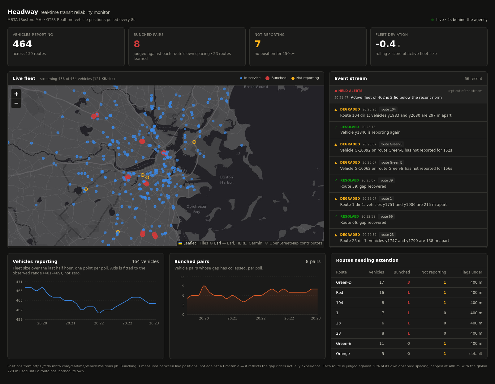

# Headway — real-time transit reliability monitor

[](https://github.com/keerthishree20/headway/actions/workflows/tests.yml)

Live GTFS-Realtime vehicle positions, streamed over a WebSocket, with bus
bunching and ghost vehicles detected as they happen.

Buses do not fail by breaking down. They fail by **bunching**: one vehicle runs
a little late, picks up the passengers meant for the next one, falls further
behind, and the follower catches it. Riders then wait through a long gap and
two buses arrive together. The timetable still says "every 8 minutes" and the
monthly on-time report still looks fine, because the failure lives between the
scheduled stops.

Headway watches the positions themselves. It measures the gap riders actually
experience, right now, and raises it the moment it collapses.



---

## What it does

| | |
|---|---|
| **Bunching detection** | Two vehicles on the same route and direction that have closed the gap between them — judged against **that route's own normal spacing**, learned from the stream. |
| **Ghost-vehicle detection** | The feed still advertises a vehicle, but no position for 150 s+. These are the buses that show on a rider's app and never arrive. |
| **Fleet anomaly** | Rolling z-score of active fleet size; ±2.5σ raises an alert. Catches a depot dropping out or a feed partially failing. |
| **Live map** | Every vehicle, state-coded, filterable to one route by clicking a route anywhere in the UI. |
| **Event stream** | Conditions are reported when they *start* and when they *clear* — not re-reported every tick. |
| **Replay on connect** | A browser joining mid-stream immediately gets the last ~30 minutes, so the page is never blank. |
| **Held alerts** | Severe events are kept in a second log, so a fleet anomaly is not evicted by a peak-hour flood of routine bunching. |
| **Server-side filtering** | A browser tells the server which route and which viewport it is drawing; the server sends only those vehicles. Measured live: **113.7 KB → 14.6 KB** per tick. |

Everything is measured against **live positions, not a timetable**, so it works
on any agency's feed without needing their static GTFS schedule.

## Why these detectors and not a model

Every rule here is one a transit planner can read and argue with:

- **Bunching** = great-circle distance between two vehicles, same route, same
  direction, under a configurable threshold.
- **Ghost** = position age over a threshold.
- **Anomaly** = rolling z-score over a 30-tick window.

No labels, no training set, no model to drift. A flagged event names the two
vehicles and the distance between them, so it can be checked in seconds. On a
civic dashboard that auditability matters more than a couple of points of
accuracy.

### Per-route thresholds, learned from the stream

A single global distance cannot fit a real network. Measured on the live MBTA
feed, the median gap between a vehicle and its nearest peer on the same route
and direction ranges from **86 m on route 1 to 3,317 m on route 110** — a 38×
spread, against a network-wide median of 1,784 m. A fixed 220 m is a collapsed
gap on the first and an unreachable one on the second.

So each route-direction learns its own normal spacing: a rolling window of
observed nearest-neighbour gaps, of which the **75th percentile** is taken as
"normal". A gap that falls to 30% of that is a collapse. The percentile is
deliberately high — bunching lives at the *bottom* of a route's gap
distribution, so learning from the median would let a route that is bunching
right now drag its own threshold down until the detector went quiet.

Until a route has 90 observed gaps it keeps the global 220 m, so a fresh start
behaves exactly like the old detector and tightens as it learns.
`GET /api/baselines` shows every route's learned number and the sample count
behind it, and the dashboard prints the threshold next to the count it
produced. An adaptive threshold nobody can inspect is worse than a fixed one.

### Why the threshold is capped at 400 m

The cap is not taste. It is where straight-line distance stops being a usable
proxy for a collapsed gap, and it was measured.

Raising a threshold always finds more pairs, so "it detects more" proves
nothing. The first instinct — score the new detections by how long they
persist — turns out to be circular: a pair survives as long as it stays under
the threshold, so a wider band keeps marginal pairs alive *by construction*.
Pair lifetime tracks the threshold, not the truth.

A threshold-independent test instead. Vehicles report the stop they are at, so
a **genuine follower traces the leader's stops** — both are working the same
stretch of the same corridor. Two vehicles passing close on opposite legs of a
folded route serve completely different stops, which is exactly the case a
great-circle distance cannot tell apart from a follower. Scoring 30 recorded
ticks of live data:

| pairs | share sharing ≥1 stop | median stop overlap |
|---|---|---|
| flagged by the fixed 220 m rule (**control**) | 65% | 0.33 |
| **added** by the adaptive rule, ceiling 400 m | 67% | 0.20 |
| **added** by the adaptive rule, ceiling 600 m+ | 33–50% | 0.00 |
| same route & direction, never flagged (**negative control**) | — | 0.00 |

Up to ~400 m the added pairs look like detections the project already trusted.
Past it they look like the pairs it never flagged at all. So the ceiling sits
at 400 m, and README limitation #1 — straight-line rather than along-route
distance — is the thing that puts it there.

Net effect on the same recorded window: **5.8 → 8.9 bunched pairs per tick**,
with the added pairs validated against the control rather than assumed.

### The false positives that mattered

Running the naive detector against live MBTA data produced **56 bunched pairs
out of ~630 vehicles** — far too many to be real. Two causes, both fixed:

1. **Staging lots.** Agencies park replacement shuttles together under one
   catch-all route id (`Shuttle-Generic` on MBTA). That alone was 30 of the 56.
   Excluded by route prefix (`EXCLUDED_ROUTE_PREFIXES`) — in the ghost detector
   too, since a spare sitting in a yard with an idle transponder is not a bus
   anyone is waiting for.
2. **Terminal layovers and coupled trains.** Two vehicles both `stopped_at`
   the *same* `stop_id` are laying over or coupled, not bunched — this is what
   produced permanent "0.0 m bunching" on the Green Line.

After both filters: **~20 pairs**, concentrated on routes 1, 22, 23, 66, 111
and 116 — Boston's actual high-frequency bus corridors, which are exactly the
routes that bunch. The filters are in `backend/app/analytics.py` and pinned by
tests.

## Architecture

```
GTFS-Realtime feed (protobuf, HTTP)
          │  one asyncio task, polls every 8s, exponential backoff on failure
          ▼
     ingest.py ──► analytics.py     bunching · ghosts · rolling z-score
          │              │          RouteBaselines: each route's own spacing,
          │              │                          learned from the stream
          ▼              ▼
              state.py               Store:      snapshot + 240-tick ring buffer
                 │                   Hub:        fan-out to every browser
                 │                   Subscriber: one queue + that client's filter
                 │                        (a slow client drops its stalest tick,
                 │                         it never stalls ingestion)
                 ▼
    FastAPI  ──  WS /ws  ──►  Next.js dashboard  (map · charts · event stream)
                 │   ▲                              │
                 │   └──── {"type":"subscribe",  ───┘  routes + viewport, so the
                 │          "routes":…, "bbox":…}      server sends only what
                 │                                     the page is drawing
                 └─  REST /api/{health,snapshot,events,history,baselines}
```

Narrowing happens in each socket's own send loop, not in the Hub: the Hub
still broadcasts one shared message to everyone, so a client with an expensive
filter pays for it in its own task and cannot slow ingestion or any other
viewer.

One process, one ingestion task, in-memory state. No Redis, no Kafka, no
database — at one poll every 8 seconds over a few hundred vehicles, a queue
broker would be infrastructure for its own sake. The trade-off is stated
plainly under [Limitations](#limitations).

## Running it

Two terminals. Python 3.10+ and Node 18+.

**Backend**

```bash
cd backend
python3.12 -m venv .venv          # any Python >= 3.10; `python3` is not
                                  # always the newest one on your PATH
./.venv/bin/pip install -r requirements.txt
./.venv/bin/uvicorn app.main:app --port 8100
```

**Frontend**

```bash
cd frontend
npm install
npm run dev          # http://localhost:3100
```

The default feed is MBTA (Boston), which publishes GTFS-Realtime with **no API
key**, so it runs immediately with nothing to sign up for.

Or `./run.sh` to start both at once — it picks a suitable interpreter, creates
the virtualenv and installs dependencies on first run.

**Tests**

```bash
cd backend
./.venv/bin/pip install -r requirements-dev.txt   # adds pytest + httpx
./.venv/bin/python -m pytest tests/ -v
```

81 tests: the detectors and the false-positive filters, the learned baselines,
and the WebSocket filter protocol driven through a real socket (including
malformed and binary frames, which must be ignored rather than close the
connection).

## Pointing it at another agency

Every setting is an environment variable — no code change:

```bash
FEED_URL=https://otd.delhi.gov.in/api/realtime/VehiclePositions.pb \
FEED_NAME="DTC (Delhi)" \
FEED_API_KEY_HEADER=key \
FEED_API_KEY=$OTD_KEY \
MAP_CENTER_LAT=28.6139 MAP_CENTER_LON=77.2090 \
./.venv/bin/uvicorn app.main:app --port 8100
```

Any `VehiclePositions.pb` endpoint works — Delhi OTD, BMTC, TriMet, Bay Area
511, MTA. Agencies that need a key generally take a header; set the header name
and value as above.

| Variable | Default | Meaning |
|---|---|---|
| `FEED_URL` | MBTA VehiclePositions | GTFS-RT vehicle positions endpoint |
| `FEED_NAME` | `MBTA (Boston, MA)` | Shown in the header |
| `FEED_API_KEY_HEADER` / `FEED_API_KEY` | — | Auth header, if the agency needs one |
| `POLL_INTERVAL_SEC` | `8` | Poll cadence |
| `BUNCH_DISTANCE_M` | `220` | Bunching threshold, used until a route has learned its own |
| `BUNCH_ADAPTIVE` | `1` | Learn a per-route threshold from the stream |
| `BUNCH_RATIO` | `0.30` | Fraction of a route's normal spacing that counts as collapsed |
| `BUNCH_BASELINE_PCT` | `75` | Percentile of observed gaps taken as normal spacing |
| `BUNCH_BASELINE_WINDOW` / `BUNCH_BASELINE_MIN_SAMPLES` | `600` / `90` | Gaps kept per route, and how many before the learned threshold is used |
| `BUNCH_DISTANCE_MIN_M` / `BUNCH_DISTANCE_MAX_M` | `80` / `400` | Clamps on the learned threshold — see above for why 400 |
| `STALE_AFTER_SEC` | `150` | Ghost-vehicle threshold |
| `EXCLUDED_ROUTE_PREFIXES` | `Shuttle-` | Route prefixes excluded from bunching |
| `ZSCORE_WINDOW` / `ZSCORE_THRESHOLD` | `30` / `2.5` | Fleet anomaly sensitivity |
| `EVENT_LOG_SIZE` / `ALERT_LOG_SIZE` | `120` / `25` | Event stream depth, and the separate held-alert log |
| `MAP_CENTER_LAT` / `MAP_CENTER_LON` / `MAP_ZOOM` | Boston | Initial map view |
| `SIMULATE` | `0` | Synthetic fleet for offline dev — see below |

`SIMULATE=1` streams a deterministic synthetic fleet (one route seeded to bunch,
vehicles that freeze at random so the ghost detector fires) so the frontend can
be developed without a network. It is **never the default**, and the header says
`SIMULATED DATA` when it is on — a civic dashboard demoing invented numbers is
worth nothing.

## Design notes

- **Two charts, never a dual axis.** Fleet size (~660) and bunched pairs (~20)
  live on different scales. A dual axis would invite the reader to see a
  correlation that isn't in the data.
- **Fleet size uses a fitted axis, and says so.** It varies a few percent
  around 660; a zero-baseline area would be a flat block. The chart is a *line*
  with the observed range printed under the title — a filled area on a
  truncated baseline is the misleading combination, a labelled line is not.
- **State is encoded twice on the map** — colour *and* size/fill — so it stays
  readable for a colourblind viewer and in print. Every event carries an icon
  and a text label; colour never carries meaning alone.
- **Light and dark are both selected**, each with its own basemap (Esri's grey
  canvas, keyless), not one theme with an inverted filter.
- **Vehicle marks render to canvas** (`preferCanvas`), so ~660 live markers
  redraw without dropping frames. Leaflet's canvas renderer cannot read CSS
  custom properties, so colours are resolved from the computed tokens in
  `lib/useThemeTokens.ts`.

## Limitations

Stated honestly, because they are the first thing a reviewer should ask about:

- **Bunching uses straight-line distance, not distance along the route.** Two
  vehicles on opposite sides of a hairpin can read as close. This is now
  measured rather than asserted: past ~400 m apart, the pairs it flags stop
  tracing each other's stops and start looking like vehicles that were never
  bunched at all. Loading each agency's static GTFS `shapes.txt` and projecting
  onto the route line would fix it, and would let the 400 m ceiling rise. It is
  still the main thing this would need before operational use.
- **No headway time.** It reports the *spatial* gap. Converting to "minutes
  apart" needs the schedule or a running speed estimate per segment.
- **State is in memory only.** A restart loses history, and it does not scale
  past one process. Persisting ticks to TimescaleDB or ClickHouse and moving
  fan-out to Redis pub/sub is the obvious next step, and deliberately not done
  here.
- **The learned threshold saturates at its ceiling for most routes.** In a
  daytime MBTA window, 37 of 41 learned route-directions wanted a threshold
  above 400 m and were capped there, so the adaptive rule is doing real work on
  the tightest routes and behaving like a fixed 400 m rule on the rest. That is
  a consequence of the straight-line limitation above, not of the learning:
  along-route distance would let the ceiling rise and the per-route number
  actually bind.
- **The baseline window has no notion of time of day.** It holds roughly the
  last 10–30 minutes of observed gaps. As evening service thins, spacing widens
  and learned thresholds rise with it, so the detector may get *louder* exactly
  when fewer buses are running. A per-hour baseline, or one keyed to the
  agency's service periods, would fix it.
- **Filtering is by route and bounding box only.** A viewer watching the whole
  network still receives the whole fleet, and metrics stay network-wide on
  purpose — a viewer watching one route still needs to see the fleet drop 200
  vehicles. Beyond a handful of unfiltered viewers, tick-to-tick deltas rather
  than full snapshots would be the next step.

## Data source

Vehicle positions from the [MBTA GTFS-Realtime
feed](https://www.mbta.com/developers/gtfs-realtime), public and keyless.
Basemap tiles © Esri; map data © OpenStreetMap contributors.
